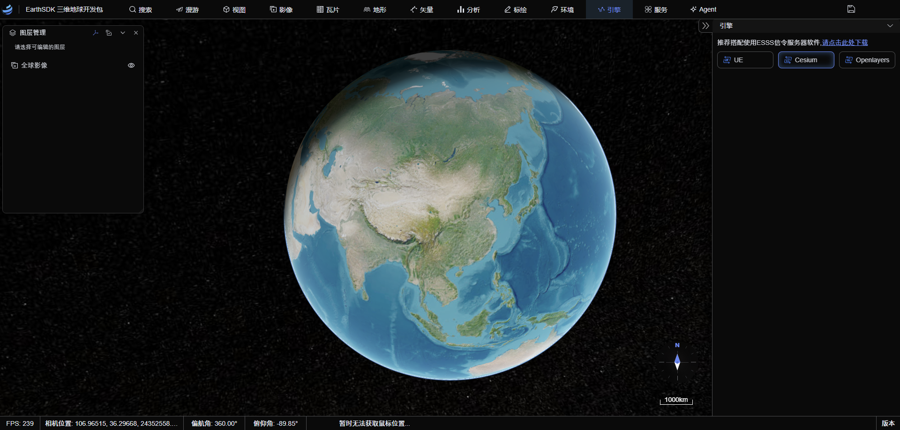

# EarthSDK 3

<p align="center">
  
</p>

<p align="center">
  <a href="https://www.earthsdk.com/earthui/index.html">Live Demo</a> •
  <a href="https://www.earthsdk.com">Quick Start</a> •
  <a href="https://www.earthsdk.com/example3/index.html">Examples</a> •
  <a href="https://www.earthsdk.com/docs/index.html">API Docs</a> •
  <a href="https://github.com/cesiumlab/earthsdk3-demos">EarthUI Source</a>
</p>

<p align="center">
  <a href="README.md">简体中文</a> | English
</p>

---

## Introduction

EarthSDK is an open-source and free secondary development framework for 3D earth visualization based on **JavaScript/TypeScript**. The framework is **independent of rendering engines**, does not rely on any specific engine, and works as a plugin for visualization engines. It is not a simple wrapper layer, but **empowers native engines** by implementing all the basic functions and effects commonly used in Digital Twin projects, with **seamless switching between multiple engines using a single codebase**.

EarthSDK was first released in 2019 and has gone through major iterations:

| Time          | Version    | Description                                                                     |
| ------------- | ---------- | ------------------------------------------------------------------------------- |
| 2019          | EarthSDK 1 | Released, providing extensive usability extensions based on the Cesium engine   |
| November 2022 | EarthSDK 2 | Combined Cesium and Unreal Engine implementations                               |
| October 2024  | EarthSDK 3 | Modularized packages, allowing flexible combination of different engine modules |

<video src="resources/czm_ue_ol.mp4" controls width="100%">
</video>

## Key Features

### Multi-Engine Support

EarthSDK 3 currently supports the following rendering engines, engines switching among each， other with more planned for the future:

| Engine            | Package            | Description                                             |
| ----------------- | ------------------ | ------------------------------------------------------- |
| **Cesium JS**     | `earthsdk3-cesium` | Browser-based WebGL earth visualization                 |
| **Unreal Engine** | `earthsdk3-ue`     | Local/cloud high-quality rendering with pixel streaming |
| **OpenLayers**    | `earthsdk3-ol`     | 2D map visualization                                    |
| **H5 WebGL**      | `earthsdk3-h5`     | UE running in browser via WebGL                         |

### Rich Scene Objects

EarthSDK 3 comes with **100+ built-in scene objects** covering all kinds of Digital Twin application scenarios:

- **Data Loading**: 3DTileset, glTF models, imagery layers, terrain layers, vector data, etc.
- **Geographic Vectors**: GeoJSON, polygons, polylines, rectangles, extruded polygons, Bézier splines, etc.
- **Analysis Tools**: Viewshed analysis, sunshine analysis, flooding analysis, height limit analysis, skyline analysis, volume measurement, etc.
- **Measurement Tools**: Distance, area, height, direction, and position measurements
- **Special Effects**: Dynamic water, explosion particles, fire particles, Gaussian splatting, etc.
- **Visualization**: POI, text labels, image labels, heatmaps, cluster layers, etc.
- **Terrain Editing**: Excavation, clipping planes, box clipping, etc.

### Flexible Deployment Options

EarthSDK 3 supports flexible deployment modes based on project requirements:

| Deployment           | Tech Stack                        | Use Case                                          |
| -------------------- | --------------------------------- | ------------------------------------------------- |
| **WebGL Rendering**  | EarthSDK JS + Cesium JS           | Pure browser rendering, zero deployment           |
| **Pixel Streaming**  | EarthSDK JS + UE + ESForUE + ESSS | Cloud rendering, high quality, large-scale scenes |
| **Local Big Screen** | EarthSDK JS + UE + ESWebView      | Local deployment, low latency, high quality       |
| **H5 Mode**          | EarthSDK JS + H5                  | UE running in browser via WebGL                   |

<p align="center">
  
</p>

### Reactive Architecture

- Built with TypeScript for complete type safety
- Built-in reactive variable system supporting data binding and change notifications
- All objects support JSON serialization/deserialization
- Component-based design pattern with clear module responsibilities

---

## Installation

### Requirements

- Node.js >= 18
- pnpm / npm / yarn

### Install EarthSDK Core Package

```sh
# Install core
pnpm add earthsdk3 --save

```

### Install Engine Packages as Needed

The EarthSDK core package is mandatory; engine packages can be chosen based on your requirements:

```sh
# Cesium engine (choose at least one)
pnpm add earthsdk3-cesium --save

# Unreal Engine engine
pnpm add earthsdk3-ue --save

# OpenLayers engine
pnpm add earthsdk3-ol --save
```

> [!NOTE]
> When installing `earthsdk3-cesium`, you need to [configure Cesium](https://cesium.com/blog/2024/02/13/configuring-vite-or-webpack-for-cesiumjs/) manually. When installing `earthsdk3-ol`, you need to install `ol` separately (currently supported version `^7.1.0`).

---

## Quick Start

### Initialize the Object Manager

Create an `ESObjectsManager` object manager and register the engines you need via generic parameters:

```typescript
import { ESObjectsManager } from "earthsdk3";
import { ESCesiumViewer } from "earthsdk3-cesium";
import { ESUeViewer } from "earthsdk3-ue";
import { ESOlViewer } from "earthsdk3-ol";

// Create object manager with multiple engines registered
const objm = new ESObjectsManager(ESCesiumViewer, ESUeViewer, ESOlViewer);

// Create a Cesium viewport
const viewer = objm.createViewer({
  type: "ESCesiumViewer",
  container: "container-id-or-element",
});

// Create a base imagery layer
const imageryLayer = objm.createSceneObjectFromJson({
  id: "94f8b01b-8659-4a34-942b-15e6ece246ca",
  type: "ESImageryLayer",
  name: "World Imagery",
  url: "https://server.arcgisonline.com/arcgis/rest/services/World_Imagery/MapServer/tile/{z}/{y}/{x}",
  maximumLevel: 18,
});
```

<p align="center">
  
</p>

### IIFE Direct Integration

If build tools are not convenient, you can use the IIFE format for direct inclusion:

```html
<!DOCTYPE html>
<html lang="en">
  <head>
    <link
      href="https://cesium.com/downloads/cesiumjs/releases/1.123/Build/Cesium/Widgets/widgets.css"
      rel="stylesheet"
    />
    <script src="https://cesium.com/downloads/cesiumjs/releases/1.123/Build/Cesium/Cesium.js"></script>
    <script src="js/earthsdk3.iife.js"></script>
    <script src="js/earthsdk3-cesium.iife.js"></script>
    <script src="js/earthsdk3-ue.iife.js"></script>
    <script src="js/earthsdk3-ol.iife.js"></script>
  </head>
  <body>
    <div id="viewerContainer"></div>
    <script>
      const { ESObjectsManager } = window["EarthSDK3"];
      const { ESCesiumViewer } = window["EarthSDK3_Cesium"];
      const { ESUeViewer } = window["EarthSDK3_UE"];
      const { ESOlViewer } = window["EarthSDK3_OL"];

      // Create object manager
      const objm = new ESObjectsManager();

      // Create viewport
      const viewer = objm.createViewer({
        type: "ESCesiumViewer",
        container: "viewerContainer",
      });

      // Create a base imagery layer
      const imageryLayer = objm.createSceneObjectFromJson({
        id: "94f8b01b-8659-4a34-942b-15e6ece246ca",
        type: "ESImageryLayer",
        name: "World Imagery",
        url: "https://server.arcgisonline.com/arcgis/rest/services/World_Imagery/MapServer/tile/{z}/{y}/{x}",
        maximumLevel: 18,
      });
    </script>
  </body>
</html>
```

---

## Core API

### ESObjectsManager

The object manager is responsible for managing all scene objects and viewport instances. Here are some key methods:

| Method                                                      | Description                     |
| ----------------------------------------------------------- | ------------------------------- |
| `createViewer(option)`                                      | Create a viewport instance      |
| `createSceneObject(type, id?)`                              | Create a scene object           |
| `getSceneObject(option?)`                                   | Get scene objects by type or ID |
| `destroySceneObject(obj)`                                   | Destroy a scene object          |
| `switchViewer(option, viewSync?, attributeSync?, destroy?)` | Switch viewport                 |
| `createCesiumViewer(params)`                                | Create Cesium viewport          |
| `createOpenLayersViewer(params)`                            | Create OpenLayers viewport      |
| `createUeViewer(params)`                                    | Create UE viewport              |

### ESViewer

The viewport base class defines a unified viewport operation interface. Here are some key methods:

| Method                                                | Description                   |
| ----------------------------------------------------- | ----------------------------- |
| `flyTo(flyToParam, position, flyMode?)`               | Fly to the target position    |
| `flyIn(position, rotation?, duration?, flyMode?)`     | Fly-in animation              |
| `pick(screenPosition)`                                | Pick an object                |
| `pickPosition(screenPosition)`                        | Get ground coordinates        |
| `changeToWalk(position, jumpZVelocity?, eyeHeight?)`  | Switch to walk mode           |
| `changeToMap()`                                       | Switch to map mode            |
| `changeToRotateGlobe(latitude?, height?, cycleTime?)` | Switch to rotating globe mode |
| `capture(resx?, resy?)`                               | Capture viewport image        |

---

## Development Guide

### Setup

```sh
# Clone the repository
git clone https://github.com/cesiumlab/earthsdk3-code.git

# Install dependencies
pnpm install

# Switch debug/build mode
node change-mode.js debug   # main points to source

# Start development mode
pnpm run dev-app1
```

### Build

```sh
# Switch debug/build mode
node change-mode.js build  # main points to dist

# Build all packages
pnpm run build-earthsdk3
pnpm run build-earthsdk3-cesium
pnpm run build-earthsdk3-ue
pnpm run build-earthsdk3-ol
```

---

## License

This development package is owned by [Beijing Xi Bu Shi Jie Technology Co., Ltd.](https://www.bjxbsj.cn).

Open-source under the [ISC License](resources/LICENSE).

---

## Community & Support

- 🌐 Official Website: [www.earthsdk.com](https://www.earthsdk.com)
- 🌏 WeChat: 地球可视化实验室
- 🌐 Company Website: [Beijing Xi Bu Shi Jie Technology Co., Ltd.](https://www.bjxbsj.cn)
- 🌐 CesiumLab Geospatial Data Processing Platform: [CesiumLab](https://www.bjxbsj.cn/cesiumlab.html)
- 🌐 PipeSer Pipeline Cloud Service: [PipeSer](https://www.bjxbsj.cn/pipeser.html)
- 🌐 ModelSer 3D Reality Data Distributed Management Platform: [ModelSer](https://www.bjxbsj.cn/modelser.html)
- 🌐 CIMRTS City Information Model Data Service Platform: [CIMRTS](https://www.bjxbsj.cn/cimrts.html)
- 🌐 TerrainRTS Terrain Elevation Data Real-time Tile Service: [TerrainRTS](https://www.bjxbsj.cn/terrainrts.html)

---

<p align="center">
  <strong>Built with ❤️ by <a href="https://www.bjxbsj.cn">Beijing Xi Bu Shi Jie Technology Co., Ltd.</a></strong>
</p>
