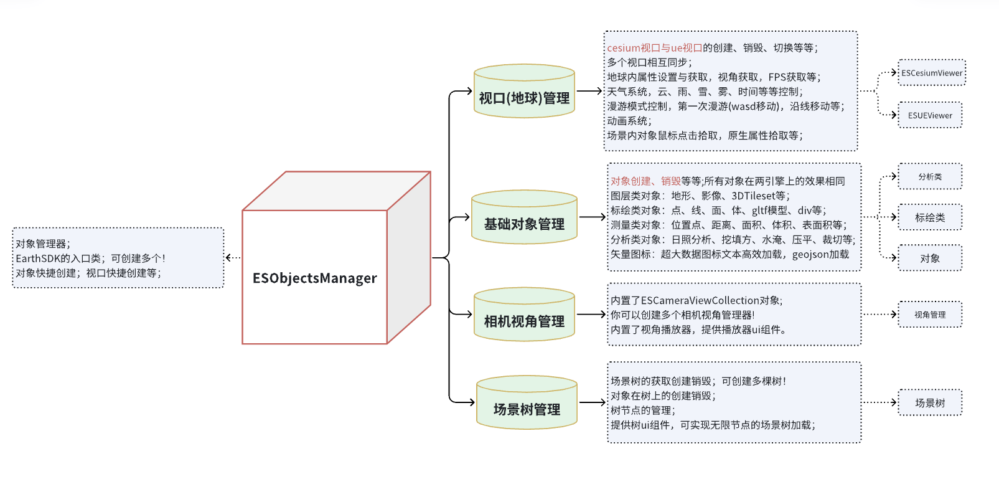

<p align="center">
  
</p>

<p align="right">
   English | <a href="README.md">简体中文</a> 
</p>

---

<p align="left">
  <a href="https://www.earthsdk.com/earthui/index.html">Live Demo</a> •
  <a href="https://www.earthsdk.com">Quick Start</a> •
  <a href="https://www.earthsdk.com/example3/index.html">Examples</a> •
  <a href="https://www.earthsdk.com/docs/guide/index.html">API Documentation</a>  •
  <a href="https://github.com/cesiumlab/earthsdk3-demos">EarthUI</a> 
</p>

EarthSDK is an open-source and free secondary development framework for earth visualization based on the JS language. The framework is independent of specific engines; it functions as a plugin for visualization engines rather than just a wrapper. It currently includes implementations for three engines: Cesium, Unreal Engine, and OpenLayers. EarthSDK is designed to empower native engines by providing all the basic functions and effects commonly used in Digital Twin projects. It implements a set of interface codes that allow seamless switching between multiple engines, with more engines like Mapbox, Unity, and Godot planned for the future.

- **2019**: EarthSDK 1 was released, providing extensive usability extensions based on the Cesium engine.
- **November 2022**: Development of EarthSDK 2 began, combining Cesium and Unreal Engine implementations.
- **October 2024**: Upgraded to EarthSDK 3, modularizing the development package to allow users to flexibly combine different engine modules.
- EarthSDK acts as middleware, serving as the "glue" between visualization engines and spatial data visualization business logic, such as traditional 3D GIS projects, Digital Twin campuses, or Smart Cities.

<p align="center">
  
</p>

Choosing a 3D visualization technology stack—whether local C/S rendering, pure WebGL, or browser plugins—has long been a challenge for developers. Once a choice is made, the cost of migration is high. EarthSDK eliminates this dilemma by allowing a single set of code to adapt to various deployment needs based on hardware environments or data security requirements:

- **EarthSDK JS + Cesium JS**: WebGL-based earth visualization in the browser.
- **EarthSDK JS + OpenLayers**: WebGL-based map visualization in the browser.
- **EarthSDK JS + UE + ESForUE + Cesium For Unreal + ESSS Signaling Server**: Pixel streaming-based visualization in the browser.
- **EarthSDK JS + UE + ESForUE + Cesium For Unreal + ESWebView**: Localized 3D rendering deployment.
- **EarthSDK JS + H5**: Loading Unreal Engine in the browser via WebGL.
- And more...

# Getting Started

### Installation

- `earthsdk3` is the mandatory base package. Choose whether to install `earthsdk3-cesium`, `earthsdk3-ol`, or `earthsdk3-ue` based on your technical needs.
- When installing `earthsdk3-cesium`, you must [configure Cesium](https://cesium.com/blog/2024/02/13/configuring-vite-or-webpack-for-cesiumjs/) manually.
- When installing `earthsdk3-ol`, you must install OpenLayers separately (currently supported version: `ol: ^7.1.0`).

```sh
pnpm add earthsdk3 --save

# pnpm add cesium
pnpm add earthsdk3-ue --save

# pnpm add cesium
pnpm add earthsdk3-cesium --save

# pnpm add ol
pnpm add earthsdk3-ol --save

```

After initializing the Object Manager, you can create engine viewport and scene objects. Creating a UE scene via browser pixel streaming requires support from the [ESSS Signaling Server](https://www.bjxbsj.cn/esss.html).

```js
import { ESObjectsManager } from "earthsdk3";
import { ESUeViewer } from "earthsdk3-ue";
import { ESCesiumViewer } from "earthsdk3-cesium";
import { ESOlViewer } from "earthsdk3-ol";

// Create Object Manager
const objm = new ESObjectsManager(ESUeViewer, ESCesiumViewer, ESOlViewer);

// Create Earth Instance
const viewer = objm.createViewer({
  type: "ESCesiumViewer",
  container: "div-container-or-id",
});
```

<p align="center">

</p>

### Direct Integration (IIFE)

```html
<!DOCTYPE html>
<html lang="en">
  <head>
    <link
      href="[https://cesium.com/downloads/cesiumjs/releases/1.123/Build/Cesium/Widgets/widgets.css](https://cesium.com/downloads/cesiumjs/releases/1.123/Build/Cesium/Widgets/widgets.css)"
      rel="stylesheet"
    />
    <script src="[https://cesium.com/downloads/cesiumjs/releases/1.123/Build/Cesium/Cesium.js](https://cesium.com/downloads/cesiumjs/releases/1.123/Build/Cesium/Cesium.js)"></script>

    <script src="js/earthsdk3.iife.js"></script>
    <script src="js/earthsdk3-cesium.iife.js"></script>
    <script src="js/earthsdk3-ue.iife.js"></script>
    <script src="js/earthsdk3-ol.iife.js"></script>
  </head>
  <body>
    <div id="viewerContainer"></div>
    <script>
      const { ESObjectsManager } = window["EarthSDK3"];
      const { ESCesiumViewer } = window["EarthSDK3_Cesium"];
      const { ESUeViewer } = window["EarthSDK3_UE"];
      const { ESOlViewer } = window["EarthSDK3_OL"];

      // Initialize Object Manager
      const objm = new ESObjectsManager(ESUeViewer, ESCesiumViewer, ESOlViewer);

      // Create Viewer
      const viewer = objm.createViewer({
        type: "ESCesiumViewer",
        container: "viewerContainer",
      });
    </script>
  </body>
</html>
```

> This development package is owned by [Beijing Xi Bu Shi Jie Technology Co., Ltd. (XBSJ)](https://www.bjxbsj.cn).
