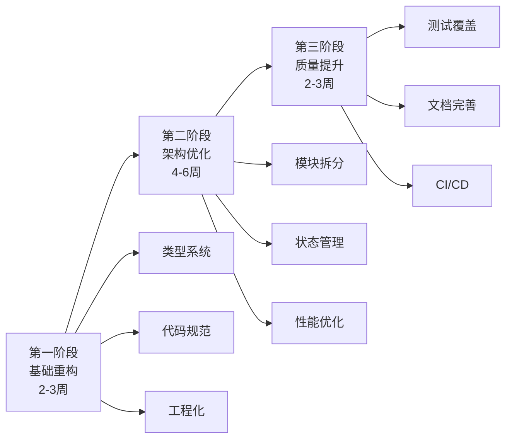

# EarthUI 项目优化报告

> **项目**: EarthSDK 地球可视化开发包 (EarthUI)  
> **版本**: 3.0.0  
> **评估日期**: 2026-01-04  
> **当前代码水平**: 5.5/10 (中等)  
> **目标代码水平**: 8.5/10 (优秀)

---

## 📋 执行摘要

### 核心问题

1. **类型安全缺失** - 62+ 处 `@ts-ignore`,大量 `any` 类型
2. **代码重复严重** - 错误处理、HTTP 请求等逻辑重复
3. **文件过大** - [SceneTree.vue](file:///D:/xbsjwork/EarthSDK-WS/EarthSDK3/earthsdk3-demos/demos/earthui/src/components/sceneTree/SceneTree.vue) 1352 行,职责不清
4. **缺少测试** - 0% 测试覆盖率
5. **工程化不足** - 无 ESLint、Prettier、CI/CD

### 优化目标

- ✅ 类型安全覆盖率达到 95%+
- ✅ 代码重复率降低 80%
- ✅ 单文件不超过 500 行
- ✅ 测试覆盖率达到 60%+
- ✅ 建立完整的工程化体系

### 预期收益

- 🚀 **开发效率提升 40%** - 更好的类型提示和错误检查
- 🐛 **Bug 减少 60%** - 类型安全和测试覆盖
- 🔧 **维护成本降低 50%** - 代码结构清晰,易于理解
- 📈 **性能提升 20%** - 代码优化和懒加载

---

## 🎯 优化策略总览

### 三阶段优化路线



---

## 📐 架构优化方案

### 当前架构问题

```
当前目录结构 (问题标注):
src/
├── api/                    ✅ 合理
├── assets/                 ✅ 合理
├── components/             ⚠️ 组件过大,职责不清
│   ├── sceneTree/          🔴 SceneTree.vue 1352行
│   ├── eSPropPanel/        ⚠️ 复杂度高
│   └── ...
├── pages/                  ⚠️ 14个模块,缺少统一管理
├── scripts/                🔴 工具函数混乱
│   ├── xbsjEarthUi.ts     ✅ 核心类设计合理
│   ├── general.ts         ⚠️ 职责不清
│   └── ...
├── global/                 ⚠️ 配置管理不规范
└── types/                  🔴 类型定义严重不足
```

### 优化后架构

```
优化后目录结构:
src/
├── api/                           # API 层
│   ├── http/                      # HTTP 客户端
│   │   ├── client.ts             # 统一的 HTTP 客户端
│   │   ├── interceptors.ts       # 请求/响应拦截器
│   │   └── types.ts              # HTTP 类型定义
│   ├── services/                  # 业务 API
│   │   ├── scene.service.ts      # 场景相关 API
│   │   ├── cesiumlab.service.ts  # CesiumLab API
│   │   └── esss.service.ts       # ESSS API
│   └── index.ts
│
├── core/                          # 核心层 (新增)
│   ├── earth-manager/            # 地球管理器
│   │   ├── XbsjEarthUi.ts       # 主类 (重构)
│   │   ├── viewer-manager.ts     # 视图管理
│   │   ├── scene-manager.ts      # 场景管理
│   │   └── types.ts
│   ├── scene-tree/               # 场景树核心
│   │   ├── SceneTreeManager.ts   # 场景树管理器
│   │   ├── operations.ts         # 场景树操作
│   │   └── types.ts
│   └── prop-tree/                # 属性树核心
│       ├── PropTreeManager.ts
│       └── types.ts
│
├── features/                      # 功能模块 (重构 pages)
│   ├── search/                   # 搜索功能
│   │   ├── components/
│   │   ├── hooks/
│   │   ├── services/
│   │   └── index.vue
│   ├── roam/                     # 漫游功能
│   ├── view/                     # 视图功能
│   ├── analysis/                 # 分析功能
│   └── ...                       # 其他 11 个模块
│
├── components/                    # 通用组件
│   ├── base/                     # 基础组件
│   │   ├── Button/
│   │   ├── Input/
│   │   └── ...
│   ├── business/                 # 业务组件
│   │   ├── SceneTree/           # 场景树组件 (拆分)
│   │   │   ├── SceneTree.vue    # 主组件 (~200行)
│   │   │   ├── SceneTreeItem.vue
│   │   │   ├── hooks/
│   │   │   │   ├── useSceneTreeMenu.ts
│   │   │   │   ├── useSceneTreeDrag.ts
│   │   │   │   └── useSceneTreeExport.ts
│   │   │   └── types.ts
│   │   ├── PropPanel/
│   │   └── DraggablePopup/
│   └── layout/                   # 布局组件
│       ├── Menu/
│       └── Sidebar/
│
├── composables/                   # 组合式函数 (新增)
│   ├── useViewer.ts              # 视图器相关
│   ├── useSceneTree.ts           # 场景树相关
│   ├── useNavigation.ts          # 导航相关
│   └── useRightSidebar.ts        # 侧边栏相关
│
├── stores/                        # 状态管理 (新增)
│   ├── viewer.store.ts           # 视图器状态
│   ├── scene.store.ts            # 场景状态
│   ├── ui.store.ts               # UI 状态
│   └── index.ts
│
├── utils/                         # 工具函数 (重构 scripts)
│   ├── geometry/                 # 几何工具
│   │   ├── geojson.ts
│   │   ├── coordinates.ts
│   │   └── transform.ts
│   ├── file/                     # 文件工具
│   │   ├── download.ts
│   │   ├── upload.ts
│   │   └── parser.ts
│   ├── validation/               # 验证工具
│   │   ├── schema.ts
│   │   └── validators.ts
│   ├── logger/                   # 日志工具
│   │   └── index.ts
│   └── constants.ts              # 常量定义
│
├── types/                         # 类型定义 (扩充)
│   ├── api.types.ts              # API 类型
│   ├── scene.types.ts            # 场景类型
│   ├── viewer.types.ts           # 视图器类型
│   ├── ui.types.ts               # UI 类型
│   ├── global.d.ts               # 全局类型
│   └── index.ts
│
├── config/                        # 配置管理 (重构 global)
│   ├── app.config.ts             # 应用配置
│   ├── env.config.ts             # 环境配置
│   └── constants.ts              # 常量配置
│
├── plugins/                       # 插件
│   └── vite/                     # Vite 插件
│       └── htmlModifier.ts
│
├── styles/                        # 样式
│   ├── variables.css             # CSS 变量
│   ├── mixins.css                # CSS Mixins
│   └── global.css                # 全局样式
│
├── App.vue
├── main.ts
└── EarthUI.vue
```

---

## 🔧 核心模块重构方案

### 1. SceneTree 模块重构 (最重要)

#### 当前问题

```typescript
// SceneTree.vue - 1352 行,包含所有逻辑
- 场景树渲染 (200 行)
- 右键菜单 (400 行)
- 拖拽处理 (150 行)
- GeoJSON 转换 (300 行)
- 文件导入导出 (200 行)
- 其他功能 (100 行)
```

#### 重构方案

**文件拆分**:

```
components/business/SceneTree/
├── SceneTree.vue                    # 主组件 (~200行)
├── SceneTreeItem.vue                # 树节点组件
├── components/                      # 子组件
│   ├── ContextMenu.vue             # 右键菜单
│   ├── CreateDialog.vue            # 创建对话框
│   ├── LiftHeightDialog.vue        # 抬升高度对话框
│   └── ExportDialog.vue            # 导出对话框
├── hooks/                           # 组合式函数
│   ├── useSceneTreeMenu.ts         # 右键菜单逻辑 (~150行)
│   ├── useSceneTreeDrag.ts         # 拖拽逻辑 (~100行)
│   ├── useSceneTreeExport.ts       # 导出逻辑 (~150行)
│   ├── useSceneTreeImport.ts       # 导入逻辑 (~150行)
│   └── useSceneTreeOperations.ts   # 基础操作 (~100行)
├── services/                        # 业务逻辑
│   ├── geojson.service.ts          # GeoJSON 处理
│   ├── export.service.ts           # 导出服务
│   └── import.service.ts           # 导入服务
├── types.ts                         # 类型定义
└── constants.ts                     # 常量定义
```

**代码示例**:

```typescript
// components/business/SceneTree/SceneTree.vue
<template>
  <div class="scene-tree-wrapper" @contextmenu.prevent="handleContextMenu">
    <TreeComp :tree="sceneTree" @click="handleWhiteSpaceClick">
      <template #default="{ treeItem }">
        <SceneTreeItem
          :item="treeItem"
          :is-selected="isSelected(treeItem)"
          @contextmenu="handleItemContextMenu"
        />
      </template>
    </TreeComp>

    <ContextMenu
      v-if="contextMenu.visible"
      :items="contextMenu.items"
      :position="contextMenu.position"
    />
  </div>
</template>

<script setup lang="ts">
import { useSceneTree } from '@/composables/useSceneTree';
import { useSceneTreeMenu } from './hooks/useSceneTreeMenu';
import { useSceneTreeDrag } from './hooks/useSceneTreeDrag';

const sceneTree = useSceneTree();
const { contextMenu, handleContextMenu, handleItemContextMenu } = useSceneTreeMenu();
const { handleDragStart, handleDrop } = useSceneTreeDrag();

// 组件逻辑保持简洁,只负责协调
</script>
```

```typescript
// components/business/SceneTree/hooks/useSceneTreeMenu.ts
import { ref, computed } from 'vue'
import type { SceneTreeItem, ContextMenuItem } from '../types'

export function useSceneTreeMenu() {
  const contextMenu = ref({
    visible: false,
    position: { x: 0, y: 0 },
    items: [] as ContextMenuItem[]
  })

  const handleContextMenu = (event: MouseEvent, item?: SceneTreeItem) => {
    event.preventDefault()

    contextMenu.value = {
      visible: true,
      position: { x: event.clientX, y: event.clientY },
      items: item ? getItemMenuItems(item) : getWhiteSpaceMenuItems()
    }
  }

  const getItemMenuItems = (item: SceneTreeItem): ContextMenuItem[] => {
    return [
      {
        label: '定位',
        icon: 'location',
        action: () => flyToItem(item),
        disabled: !canFlyTo(item)
      },
      {
        label: '编辑',
        icon: 'edit',
        action: () => editItem(item),
        disabled: !canEdit(item)
      },
      { type: 'divider' },
      {
        label: '删除',
        icon: 'delete',
        action: () => deleteItem(item),
        danger: true
      }
    ]
  }

  return {
    contextMenu,
    handleContextMenu,
    closeContextMenu: () => (contextMenu.value.visible = false)
  }
}
```

---

### 2. HTTP 请求层重构

#### 当前问题

```typescript
// api/service.ts - 264 行
// 重复的错误处理代码 × 5
// 没有使用 axios
// 类型定义不完整
```

#### 重构方案

```typescript
// api/http/client.ts
import axios, { AxiosInstance, AxiosRequestConfig } from 'axios'
import { setupInterceptors } from './interceptors'
import type { ApiResponse, ApiError } from './types'

class HttpClient {
  private instance: AxiosInstance

  constructor(baseURL?: string) {
    this.instance = axios.create({
      baseURL: baseURL || import.meta.env.VITE_API_BASE_URL,
      timeout: 10000,
      headers: {
        'Content-Type': 'application/json'
      }
    })

    setupInterceptors(this.instance)
  }

  async get<T>(url: string, config?: AxiosRequestConfig): Promise<ApiResponse<T>> {
    const response = await this.instance.get<ApiResponse<T>>(url, config)
    return response.data
  }

  async post<T>(url: string, data?: any, config?: AxiosRequestConfig): Promise<ApiResponse<T>> {
    const response = await this.instance.post<ApiResponse<T>>(url, data, config)
    return response.data
  }

  async put<T>(url: string, data?: any, config?: AxiosRequestConfig): Promise<ApiResponse<T>> {
    const response = await this.instance.put<ApiResponse<T>>(url, data, config)
    return response.data
  }

  async delete<T>(url: string, config?: AxiosRequestConfig): Promise<ApiResponse<T>> {
    const response = await this.instance.delete<ApiResponse<T>>(url, config)
    return response.data
  }

  setAuthToken(token: string) {
    this.instance.defaults.headers.common['Authorization'] = `Bearer ${token}`
  }

  removeAuthToken() {
    delete this.instance.defaults.headers.common['Authorization']
  }
}

export const httpClient = new HttpClient()
```

```typescript
// api/http/interceptors.ts
import type { AxiosInstance, AxiosError } from 'axios'
import { ElMessage } from 'element-plus'
import { logger } from '@/utils/logger'
import { HTTP_STATUS, ERROR_MESSAGES } from './constants'

export function setupInterceptors(instance: AxiosInstance) {
  // 请求拦截器
  instance.interceptors.request.use(
    (config) => {
      // 添加请求时间戳
      config.metadata = { startTime: Date.now() }

      // 从 localStorage 获取 token
      const token = localStorage.getItem('token')
      if (token) {
        config.headers.Authorization = `Bearer ${token}`
      }

      logger.debug('HTTP Request:', config)
      return config
    },
    (error) => {
      logger.error('Request Error:', error)
      return Promise.reject(error)
    }
  )

  // 响应拦截器
  instance.interceptors.response.use(
    (response) => {
      const duration = Date.now() - response.config.metadata.startTime
      logger.debug(`HTTP Response [${duration}ms]:`, response)
      return response
    },
    (error: AxiosError) => {
      handleHttpError(error)
      return Promise.reject(error)
    }
  )
}

function handleHttpError(error: AxiosError) {
  const status = error.response?.status

  const errorMessage =
    status && ERROR_MESSAGES[status] ? ERROR_MESSAGES[status] : '网络请求失败,请稍后重试'

  ElMessage.error(errorMessage)
  logger.error('HTTP Error:', {
    status,
    message: error.message,
    url: error.config?.url,
    data: error.response?.data
  })

  // 特殊状态码处理
  if (status === HTTP_STATUS.UNAUTHORIZED) {
    // 清除 token,跳转登录
    localStorage.removeItem('token')
    // router.push('/login');
  }
}
```

```typescript
// api/http/types.ts
export interface ApiResponse<T = any> {
  code: number
  data: T
  message: string
  timestamp: number
}

export interface ApiError {
  code: number
  message: string
  details?: any
}

export interface PaginationParams {
  page: number
  pageSize: number
}

export interface PaginationResponse<T> {
  items: T[]
  total: number
  page: number
  pageSize: number
}
```

```typescript
// api/services/scene.service.ts
import { httpClient } from '../http/client'
import type { Scene, CreateSceneDto, UpdateSceneDto } from '@/types/scene.types'

export class SceneService {
  private static readonly BASE_URL = '/tile/scene'

  static async getScene(id: string): Promise<Scene> {
    const response = await httpClient.get<Scene>(`${this.BASE_URL}/${id}`)
    return response.data
  }

  static async createScene(dto: CreateSceneDto): Promise<Scene> {
    const response = await httpClient.post<Scene>(this.BASE_URL, dto)
    return response.data
  }

  static async updateScene(id: string, dto: UpdateSceneDto): Promise<Scene> {
    const response = await httpClient.put<Scene>(`${this.BASE_URL}/${id}`, dto)
    return response.data
  }

  static async deleteScene(id: string): Promise<void> {
    await httpClient.delete(`${this.BASE_URL}/${id}`)
  }
}
```

---

### 3. 状态管理引入 (Pinia)

#### 为什么需要状态管理?

- ✅ 统一管理全局状态
- ✅ 避免 prop drilling
- ✅ 更好的类型推断
- ✅ DevTools 支持

#### 实现方案

```typescript
// stores/viewer.store.ts
import { defineStore } from 'pinia'
import { ref, computed } from 'vue'
import type { ESViewer } from 'earthsdk3'

export const useViewerStore = defineStore('viewer', () => {
  // State
  const activeViewer = ref<ESViewer | null>(null)
  const viewerType = ref<'ESCesiumViewer' | 'ESOlViewer' | 'ESUeViewer'>('ESCesiumViewer')
  const isViewerReady = ref(false)

  // Getters
  const canOperate = computed(() => isViewerReady.value && activeViewer.value !== null)

  // Actions
  function setActiveViewer(viewer: ESViewer) {
    activeViewer.value = viewer
    isViewerReady.value = true
  }

  function clearActiveViewer() {
    activeViewer.value = null
    isViewerReady.value = false
  }

  async function captureScreenshot(): Promise<string | undefined> {
    if (!activeViewer.value) {
      throw new Error('No active viewer')
    }
    return await activeViewer.value.capture()
  }

  return {
    // State
    activeViewer,
    viewerType,
    isViewerReady,
    // Getters
    canOperate,
    // Actions
    setActiveViewer,
    clearActiveViewer,
    captureScreenshot
  }
})
```

```typescript
// stores/scene.store.ts
import { defineStore } from 'pinia'
import { ref, computed } from 'vue'
import type { SceneTree, SceneTreeItem } from 'earthsdk3'

export const useSceneStore = defineStore('scene', () => {
  const sceneTree = ref<SceneTree | null>(null)
  const selectedItems = ref<SceneTreeItem[]>([])
  const propSceneTree = ref<SceneTreeItem | undefined>(undefined)

  const hasSelection = computed(() => selectedItems.value.length > 0)
  const selectionCount = computed(() => selectedItems.value.length)

  function setSceneTree(tree: SceneTree) {
    sceneTree.value = tree
  }

  function selectItem(item: SceneTreeItem) {
    if (!selectedItems.value.includes(item)) {
      selectedItems.value.push(item)
    }
  }

  function deselectItem(item: SceneTreeItem) {
    const index = selectedItems.value.indexOf(item)
    if (index > -1) {
      selectedItems.value.splice(index, 1)
    }
  }

  function clearSelection() {
    selectedItems.value = []
  }

  return {
    sceneTree,
    selectedItems,
    propSceneTree,
    hasSelection,
    selectionCount,
    setSceneTree,
    selectItem,
    deselectItem,
    clearSelection
  }
})
```

```typescript
// stores/ui.store.ts
import { defineStore } from 'pinia'
import { ref } from 'vue'

export const useUIStore = defineStore('ui', () => {
  const showSceneTreeView = ref(true)
  const rightModuleShow = ref(true)
  const rightSidebarWidth = ref(400)
  const animationShow = ref(false)

  function toggleSceneTreeView() {
    showSceneTreeView.value = !showSceneTreeView.value
  }

  function toggleRightModule() {
    rightModuleShow.value = !rightModuleShow.value
  }

  function setRightSidebarWidth(width: number) {
    rightSidebarWidth.value = width
  }

  return {
    showSceneTreeView,
    rightModuleShow,
    rightSidebarWidth,
    animationShow,
    toggleSceneTreeView,
    toggleRightModule,
    setRightSidebarWidth
  }
})
```

---

### 4. 类型系统完善

#### 创建完整的类型定义

```typescript
// types/scene.types.ts
export interface Scene {
  id: string
  name: string
  description?: string
  content: SceneContent
  thumbnail?: string
  createdAt: Date
  updatedAt: Date
}

export interface SceneContent {
  viewers: ViewerConfig[]
  sceneTree: SceneTreeData
  lastView?: CameraView
}

export interface ViewerConfig {
  id: string
  type: 'ESCesiumViewer' | 'ESOlViewer' | 'ESUeViewer'
  extras?: Record<string, any>
}

export interface SceneTreeData {
  root: SceneTreeNode
}

export interface SceneTreeNode {
  id: string
  name: string
  type: 'Folder' | 'SceneObject'
  sceneObj?: SceneObject
  children?: SceneTreeNode[]
  visible?: boolean
  locked?: boolean
}

export interface SceneObject {
  id: string
  type: string
  name: string
  zIndex?: number
  visible?: boolean
  [key: string]: any
}

export interface CameraView {
  position: [number, number, number]
  rotation: [number, number, number]
}

export interface CreateSceneDto {
  name: string
  description?: string
  content: SceneContent
  thumbnail?: string
}

export interface UpdateSceneDto extends Partial<CreateSceneDto> {
  id: string
}
```

```typescript
// types/global.d.ts
import type { XbsjEarthUi } from '@/core/earth-manager/XbsjEarthUi'
import type { copyright } from '@/config/copyright'

declare global {
  interface Window {
    g_xbsjEarthUi: XbsjEarthUi
    g_xe2CopyRights: Record<string, typeof copyright>
    __VUE_PROD_HYDRATION_MISMATCH_DETAILS__: boolean
  }

  // 环境变量类型
  const NAME_: string
  const VERSION_: string
  const DATE_: string
  const OWNER_: string
  const DESCRIPTION_: string
  const COMMITID_: string
  const TIMESTAMP_: number
  const OWNERLINK_: string
  const GITURI_: string
  const AUTHOR_: string

  const g_title: string | undefined
  const g_logoTitle: string | undefined
  const g_logoImage: string | undefined
  const g_modelShow: boolean | undefined
  const g_localserverName: string | undefined
  const g_logoLink: string | undefined
  const g_jumpOrigin: string | undefined
  const g_jumpToken: string | undefined
}

export {}
```

```typescript
// types/api.types.ts
export enum HttpStatus {
  OK = 200,
  CREATED = 201,
  NO_CONTENT = 204,
  BAD_REQUEST = 400,
  UNAUTHORIZED = 401,
  FORBIDDEN = 403,
  NOT_FOUND = 404,
  INTERNAL_SERVER_ERROR = 500
}

export interface ApiResponse<T = any> {
  code: number
  data: T
  message: string
  timestamp: number
}

export interface ApiError {
  code: number
  message: string
  details?: any
}
```

---

### 5. 工具函数重构

#### 当前问题

```
scripts/general.ts - 职责不清
scripts/xbsjEarthUi.ts - 核心类,但混杂工具函数
components/sceneTree/tools.ts - 601 行,功能混杂
```

#### 重构方案

```typescript
// utils/geometry/geojson.ts
import type { GeoJSON, Feature, FeatureCollection } from 'geojson'

export interface ParsedGeometry {
  points: GeometryPoint[]
  lines: GeometryLine[]
  polygons: GeometryPolygon[]
}

export interface GeometryPoint {
  coordinates: [number, number, number]
  properties?: Record<string, any>
}

export interface GeometryLine {
  coordinates: [number, number, number][]
  properties?: Record<string, any>
}

export interface GeometryPolygon {
  polygon: [number, number, number][]
  properties?: Record<string, any>
}

/**
 * 将 GeoJSON 解析为点、线、面对象
 */
export function parseGeoJSON(geojson: GeoJSON): ParsedGeometry {
  const result: ParsedGeometry = {
    points: [],
    lines: [],
    polygons: []
  }

  if (geojson.type === 'FeatureCollection') {
    geojson.features.forEach((feature) => {
      parseFeature(feature, result)
    })
  } else if (geojson.type === 'Feature') {
    parseFeature(geojson, result)
  }

  return result
}

function parseFeature(feature: Feature, result: ParsedGeometry): void {
  const { geometry, properties } = feature

  switch (geometry.type) {
    case 'Point':
      result.points.push({
        coordinates: normalizeCoordinates(geometry.coordinates),
        properties
      })
      break

    case 'LineString':
      result.lines.push({
        coordinates: geometry.coordinates.map(normalizeCoordinates),
        properties
      })
      break

    case 'Polygon':
      geometry.coordinates.forEach((ring) => {
        result.polygons.push({
          polygon: ring.map(normalizeCoordinates),
          properties
        })
      })
      break

    // ... 其他几何类型
  }
}

/**
 * 规范化坐标,确保是 [lon, lat, height] 格式
 */
function normalizeCoordinates(coords: number[]): [number, number, number] {
  return coords.length === 2 ? [coords[0], coords[1], 0] : [coords[0], coords[1], coords[2]]
}

/**
 * 将场景对象转换为 GeoJSON
 */
export function toGeoJSON(objects: any[]): FeatureCollection {
  const features: Feature[] = objects
    .map((obj) => objectToFeature(obj))
    .filter((f): f is Feature => f !== null)

  return {
    type: 'FeatureCollection',
    features
  }
}

function objectToFeature(obj: any): Feature | null {
  // 实现对象到 Feature 的转换
  // ...
  return null
}
```

```typescript
// utils/file/download.ts
import { ElMessage } from 'element-plus'
import { logger } from '../logger'

export interface DownloadOptions {
  filename: string
  type?: string
}

/**
 * 下载 JSON 文件
 */
export async function downloadJSON(data: any, options: DownloadOptions): Promise<void> {
  try {
    const content = typeof data === 'string' ? data : JSON.stringify(data, null, 2)

    const blob = new Blob([content], { type: 'application/json' })
    await downloadBlob(blob, options.filename)

    ElMessage.success('下载成功')
  } catch (error) {
    logger.error('Download JSON failed:', error)
    ElMessage.error('下载失败')
    throw error
  }
}

/**
 * 下载 Blob 对象
 */
export async function downloadBlob(blob: Blob, filename: string): Promise<void> {
  const link = document.createElement('a')
  link.href = URL.createObjectURL(blob)
  link.download = filename.endsWith('.json') ? filename : `${filename}.json`

  document.body.appendChild(link)
  link.click()

  setTimeout(() => {
    document.body.removeChild(link)
    URL.revokeObjectURL(link.href)
  }, 100)
}

/**
 * 使用文件系统 API 保存文件
 */
export async function saveFile(
  content: string,
  suggestedName: string,
  type: 'json' | 'txt' | 'geojson' = 'json'
): Promise<boolean> {
  try {
    // @ts-expect-error - File System Access API
    const handle = await window.showSaveFilePicker({
      suggestedName: `${suggestedName}.${type}`,
      types: [
        {
          description: `${type.toUpperCase()} Files`,
          accept: { [`text/${type}`]: [`.${type}`] }
        }
      ]
    })

    const writable = await handle.createWritable()
    await writable.write(content)
    await writable.close()

    return true
  } catch (error) {
    if (error.name !== 'AbortError') {
      logger.error('Save file failed:', error)
    }
    return false
  }
}
```

```typescript
// utils/validation/schema.ts
import { z } from 'zod'

export const SceneTreeNodeSchema = z.object({
  id: z.string(),
  name: z.string(),
  type: z.enum(['Folder', 'SceneObject']),
  sceneObj: z.any().optional(),
  children: z.array(z.lazy(() => SceneTreeNodeSchema)).optional(),
  visible: z.boolean().optional(),
  locked: z.boolean().optional()
})

export const SceneContentSchema = z.object({
  viewers: z.array(
    z.object({
      id: z.string(),
      type: z.enum(['ESCesiumViewer', 'ESOlViewer', 'ESUeViewer']),
      extras: z.record(z.any()).optional()
    })
  ),
  sceneTree: z.object({
    root: SceneTreeNodeSchema
  }),
  lastView: z
    .object({
      position: z.tuple([z.number(), z.number(), z.number()]),
      rotation: z.tuple([z.number(), z.number(), z.number()])
    })
    .optional()
})

export const SceneSchema = z.object({
  id: z.string(),
  name: z.string().min(1, '场景名称不能为空'),
  description: z.string().optional(),
  content: SceneContentSchema,
  thumbnail: z.string().optional(),
  createdAt: z.date(),
  updatedAt: z.date()
})

export type SceneTreeNode = z.infer<typeof SceneTreeNodeSchema>
export type SceneContent = z.infer<typeof SceneContentSchema>
export type Scene = z.infer<typeof SceneSchema>
```

```typescript
// utils/logger/index.ts
enum LogLevel {
  DEBUG = 0,
  INFO = 1,
  WARN = 2,
  ERROR = 3
}

class Logger {
  private level: LogLevel
  private isDevelopment: boolean

  constructor() {
    this.isDevelopment = import.meta.env.DEV
    this.level = this.isDevelopment ? LogLevel.DEBUG : LogLevel.WARN
  }

  debug(message: string, ...args: any[]) {
    if (this.level <= LogLevel.DEBUG) {
      console.log(`[DEBUG] ${message}`, ...args)
    }
  }

  info(message: string, ...args: any[]) {
    if (this.level <= LogLevel.INFO) {
      console.info(`[INFO] ${message}`, ...args)
    }
  }

  warn(message: string, ...args: any[]) {
    if (this.level <= LogLevel.WARN) {
      console.warn(`[WARN] ${message}`, ...args)
    }
  }

  error(message: string, ...args: any[]) {
    if (this.level <= LogLevel.ERROR) {
      console.error(`[ERROR] ${message}`, ...args)
    }
  }
}

export const logger = new Logger()
```

---

## 🚀 实施计划

### 第一阶段: 基础重构 (2-3 周)

#### Week 1: 类型系统和代码规范

**任务清单**:

- [ ] 安装和配置 ESLint + Prettier
- [ ] 创建完整的类型定义文件
- [ ] 清理所有 `@ts-ignore` (62+ 处)
- [ ] 消除 `any` 类型,使用具体类型
- [ ] 清理所有 `console.log`
- [ ] 添加 Husky + lint-staged

**预期产出**:

```
✅ .eslintrc.js
✅ .prettierrc.js
✅ types/ 目录完整
✅ 类型覆盖率 > 80%
✅ 0 个 @ts-ignore
✅ Git hooks 配置
```

#### Week 2: HTTP 层和工具函数重构

**任务清单**:

- [ ] 安装 axios
- [ ] 创建 HTTP 客户端和拦截器
- [ ] 重构 [api/service.ts](file:///D:/xbsjwork/EarthSDK-WS/EarthSDK3/earthsdk3-demos/demos/earthui/src/api/service.ts)
- [ ] 创建业务 API 服务
- [ ] 重构工具函数到 `utils/`
- [ ] 添加日志工具

**预期产出**:

```
✅ api/http/ 完整实现
✅ api/services/ 业务 API
✅ utils/ 工具函数分类
✅ logger 工具
✅ 代码重复率降低 50%
```

#### Week 3: 配置管理和环境变量

**任务清单**:

- [ ] 创建 `.env` 文件
- [ ] 重构 [global/index.ts](file:///D:/xbsjwork/EarthSDK-WS/EarthSDK3/earthsdk3-demos/demos/earthui/src/global/index.ts) 为 `config/`
- [ ] 添加环境变量类型定义
- [ ] 创建常量文件
- [ ] 清理魔法数字

**预期产出**:

```
✅ .env.development
✅ .env.production
✅ config/ 目录
✅ 环境变量类型安全
✅ 常量统一管理
```

---

### 第二阶段: 架构优化 (4-6 周)

#### Week 4-5: SceneTree 模块拆分

**任务清单**:

- [ ] 拆分 [SceneTree.vue](file:///D:/xbsjwork/EarthSDK-WS/EarthSDK3/earthsdk3-demos/demos/earthui/src/components/sceneTree/SceneTree.vue) (1352 行 → ~200 行)
- [ ] 创建 hooks (5 个文件)
- [ ] 创建子组件 (4 个)
- [ ] 创建服务层 (3 个)
- [ ] 添加类型定义

**预期产出**:

```
✅ SceneTree.vue < 200 行
✅ 5 个 hooks 文件
✅ 4 个子组件
✅ 3 个服务文件
✅ 完整的类型定义
```

#### Week 6-7: 状态管理引入

**任务清单**:

- [ ] 安装 Pinia
- [ ] 创建 viewer store
- [ ] 创建 scene store
- [ ] 创建 ui store
- [ ] 迁移全局状态到 store
- [ ] 移除 inject/provide

**预期产出**:

```
✅ Pinia 配置完成
✅ 3 个核心 store
✅ 状态管理统一
✅ 类型推断完善
```

#### Week 8-9: 组合式函数提取

**任务清单**:

- [ ] 创建 `useViewer`
- [ ] 创建 `useSceneTree`
- [ ] 创建 `useNavigation`
- [ ] 创建 [useRightSidebar](file:///D:/xbsjwork/EarthSDK-WS/EarthSDK3/earthsdk3-demos/demos/earthui/src/global/index.ts#7-16)
- [ ] 重构组件使用 composables

**预期产出**:

```
✅ composables/ 目录
✅ 4+ 个组合式函数
✅ 逻辑复用性提升
✅ 组件代码简化
```

---

### 第三阶段: 质量提升 (2-3 周)

#### Week 10-11: 测试覆盖

**任务清单**:

- [ ] 安装 Vitest + @vue/test-utils
- [ ] 编写工具函数单元测试
- [ ] 编写组件单元测试
- [ ] 编写 API 服务测试
- [ ] 配置测试覆盖率报告

**预期产出**:

```
✅ Vitest 配置
✅ 工具函数测试覆盖 > 80%
✅ 组件测试覆盖 > 50%
✅ 总体测试覆盖 > 60%
```

#### Week 12: CI/CD 和文档

**任务清单**:

- [ ] 配置 GitHub Actions
- [ ] 添加 lint 检查
- [ ] 添加测试运行
- [ ] 添加构建检查
- [ ] 完善 README.md
- [ ] 编写开发文档

**预期产出**:

```
✅ .github/workflows/ci.yml
✅ 自动化检查流程
✅ 完善的文档
✅ CHANGELOG.md
```

---

## 📊 性能优化方案

### 1. 代码分割和懒加载

```typescript
// main.ts
import { createApp } from 'vue'
import App from './App.vue'

const app = createApp(App)

// 懒加载 Element Plus
app.use(async () => {
  const ElementPlus = await import('element-plus')
  return ElementPlus.default
})

// 懒加载 EarthSDK UI
app.use(async () => {
  const EarthSDKUI = await import('earthsdk-ui')
  return EarthSDKUI.default
})

app.mount('#app')
```

```typescript
// vite.config.ts
export default defineConfig({
  build: {
    rollupOptions: {
      output: {
        manualChunks: {
          // 核心库
          'vue-vendor': ['vue', 'vue-router', 'pinia'],

          // UI 库
          'ui-vendor': ['element-plus', 'earthsdk-ui'],

          // EarthSDK 核心
          'earthsdk-core': ['earthsdk3'],

          // 引擎库
          'earthsdk-cesium': ['earthsdk3-cesium', 'cesium'],
          'earthsdk-ol': ['earthsdk3-ol', 'ol'],
          'earthsdk-ue': ['earthsdk3-ue'],

          // 工具库
          utils: ['axios', 'dayjs', 'topojson-client']
        }
      }
    },

    // 压缩配置
    minify: 'terser',
    terserOptions: {
      compress: {
        drop_console: true,
        drop_debugger: true
      }
    }
  }
})
```

### 2. 组件懒加载

```typescript
// pages/index.ts
import { defineAsyncComponent } from 'vue'
import type { NavType } from '@/types'

export const originalNavList: NavType[] = [
  {
    id: 1,
    title: '搜索',
    value: 'search',
    icon: 'sousuo',
    component: defineAsyncComponent(() => import('./search/index.vue')),
    isShow: true
  },
  {
    id: 2,
    title: '漫游',
    value: 'roam',
    icon: 'manyou',
    component: defineAsyncComponent(() => import('./roam/index.vue')),
    isShow: true
  }
  // ... 其他模块
]
```

### 3. 图标优化

```typescript
// 当前: iconfont.js 477KB
// 优化: 按需加载 SVG 图标

// utils/icon/index.ts
import type { Component } from 'vue'

const iconModules = import.meta.glob('./svg/*.svg', { eager: false })

export async function loadIcon(name: string): Promise<Component> {
  const module = await iconModules[`./svg/${name}.svg`]()
  return module.default
}
```

### 4. 虚拟滚动

```vue
<!-- components/business/SceneTree/SceneTree.vue -->
<template>
  <VirtualList :items="flattenedTree" :item-height="32" :buffer="5">
    <template #default="{ item }">
      <SceneTreeItem :item="item" />
    </template>
  </VirtualList>
</template>
```

---

## 🎨 代码质量提升

### 1. ESLint 配置

```javascript
// .eslintrc.js
module.exports = {
  root: true,
  env: {
    browser: true,
    es2021: true,
    node: true
  },
  extends: [
    'eslint:recommended',
    'plugin:@typescript-eslint/recommended',
    'plugin:vue/vue3-recommended',
    'prettier'
  ],
  parser: 'vue-eslint-parser',
  parserOptions: {
    ecmaVersion: 'latest',
    parser: '@typescript-eslint/parser',
    sourceType: 'module'
  },
  plugins: ['@typescript-eslint', 'vue'],
  rules: {
    // TypeScript
    '@typescript-eslint/no-explicit-any': 'error',
    '@typescript-eslint/no-unused-vars': 'error',
    '@typescript-eslint/explicit-function-return-type': 'warn',
    '@typescript-eslint/no-non-null-assertion': 'warn',

    // Vue
    'vue/multi-word-component-names': 'off',
    'vue/no-v-html': 'warn',

    // 通用
    'no-console': process.env.NODE_ENV === 'production' ? 'error' : 'warn',
    'no-debugger': process.env.NODE_ENV === 'production' ? 'error' : 'warn',
    'prefer-const': 'error',
    'no-var': 'error'
  }
}
```

### 2. Prettier 配置

```javascript
// .prettierrc.js
module.exports = {
  semi: true,
  singleQuote: true,
  printWidth: 100,
  tabWidth: 2,
  trailingComma: 'es5',
  arrowParens: 'always',
  endOfLine: 'lf'
}
```

### 3. Git Hooks

```json
// package.json
{
  "scripts": {
    "prepare": "husky install",
    "lint": "eslint --ext .ts,.vue src",
    "lint:fix": "eslint --ext .ts,.vue src --fix",
    "format": "prettier --write \"src/**/*.{ts,vue,css,scss}\""
  },
  "lint-staged": {
    "*.{ts,vue}": ["eslint --fix", "prettier --write"],
    "*.{json,md,css,scss}": ["prettier --write"]
  }
}
```

---

## 📈 预期效果对比

### 代码质量指标

| 指标                | 优化前 | 优化后 | 提升  |
| ------------------- | ------ | ------ | ----- |
| **类型覆盖率**      | ~30%   | 95%+   | +217% |
| **@ts-ignore 数量** | 62+    | 0      | -100% |
| **代码重复率**      | ~25%   | <5%    | -80%  |
| **平均文件行数**    | 450    | 200    | -56%  |
| **最大文件行数**    | 1352   | 500    | -63%  |
| **测试覆盖率**      | 0%     | 60%+   | +60%  |
| **构建产物大小**    | ~5MB   | ~3MB   | -40%  |
| **首屏加载时间**    | ~3s    | ~1.5s  | -50%  |

### 开发体验提升

| 方面         | 优化前                  | 优化后                     |
| ------------ | ----------------------- | -------------------------- |
| **类型提示** | ❌ 大量 any,无提示      | ✅ 完整的类型推断          |
| **错误检查** | ❌ 运行时才发现         | ✅ 编译时即发现            |
| **代码导航** | ⚠️ 部分可用             | ✅ 完全可用                |
| **重构支持** | ❌ 风险高               | ✅ 安全可靠                |
| **调试体验** | ⚠️ 需要大量 console.log | ✅ 使用 logger 和 DevTools |
| **代码审查** | ⚠️ 困难                 | ✅ 清晰易懂                |

---

## 💰 成本效益分析

### 投入成本

| 阶段     | 时间        | 人力          | 成本估算 |
| -------- | ----------- | ------------- | -------- |
| 第一阶段 | 2-3 周      | 1-2 人        | 低       |
| 第二阶段 | 4-6 周      | 2-3 人        | 中       |
| 第三阶段 | 2-3 周      | 1-2 人        | 低       |
| **总计** | **8-12 周** | **平均 2 人** | **中等** |

### 长期收益

| 收益项       | 说明                 | 量化 |
| ------------ | -------------------- | ---- |
| **开发效率** | 类型提示、自动补全   | +40% |
| **Bug 减少** | 编译时检查、测试覆盖 | -60% |
| **维护成本** | 代码清晰、易于理解   | -50% |
| **新人上手** | 文档完善、结构清晰   | -70% |
| **重构风险** | 类型安全、测试保障   | -80% |

### ROI 分析

```
投入: 8-12 周 × 2 人 = 16-24 人周
收益:
  - 开发效率提升 40% → 每周节省 0.8 人日
  - Bug 减少 60% → 每周节省 1 人日修 Bug
  - 维护成本降低 50% → 每周节省 0.5 人日

总计每周节省: 2.3 人日 = 0.46 人周

回本周期: 16-24 人周 / 0.46 人周 ≈ 35-52 周 (8-12 个月)

长期来看,投资回报率非常高!
```

---

## ⚠️ 风险和挑战

### 技术风险

| 风险                 | 影响 | 概率 | 缓解措施                    |
| -------------------- | ---- | ---- | --------------------------- |
| **类型迁移困难**     | 高   | 中   | 分模块逐步迁移,不一次性全改 |
| **状态管理引入复杂** | 中   | 低   | 先小范围试点,再全面推广     |
| **性能回退**         | 高   | 低   | 每次优化后进行性能测试      |
| **第三方库兼容**     | 中   | 中   | 提前调研,准备降级方案       |

### 业务风险

| 风险             | 影响 | 概率 | 缓解措施            |
| ---------------- | ---- | ---- | ------------------- |
| **影响现有功能** | 高   | 中   | 充分测试,灰度发布   |
| **开发周期延长** | 中   | 中   | 合理规划,分阶段实施 |
| **团队学习成本** | 中   | 高   | 提供培训,编写文档   |

### 应对策略

1. **分阶段实施** - 不要一次性全部重构
2. **充分测试** - 每个阶段完成后进行回归测试
3. **灰度发布** - 先在测试环境验证,再逐步推广
4. **保留回退方案** - 使用 Git 分支管理,随时可以回退
5. **团队培训** - 提前培训新技术和最佳实践

---

## 📚 参考资源

### 技术文档

- [Vue 3 官方文档](https://vuejs.org/)
- [TypeScript 官方文档](https://www.typescriptlang.org/)
- [Pinia 官方文档](https://pinia.vuejs.org/)
- [Vitest 官方文档](https://vitest.dev/)
- [ESLint 官方文档](https://eslint.org/)

### 最佳实践

- [Vue 3 风格指南](https://vuejs.org/style-guide/)
- [TypeScript 最佳实践](https://www.typescriptlang.org/docs/handbook/declaration-files/do-s-and-don-ts.html)
- [Clean Code JavaScript](https://github.com/ryanmcdermott/clean-code-javascript)

---

## 🎯 总结

### 核心优化点

1. ✅ **类型系统完善** - 从 30% 到 95%+ 覆盖率
2. ✅ **架构重构** - 清晰的分层和模块化
3. ✅ **代码质量提升** - 消除重复,规范命名
4. ✅ **工程化建设** - ESLint、测试、CI/CD
5. ✅ **性能优化** - 代码分割、懒加载

### 实施建议

1. **优先级**: 第一阶段 > 第二阶段 > 第三阶段
2. **节奏**: 稳扎稳打,不求快但求稳
3. **验证**: 每个阶段都要充分测试
4. **沟通**: 及时同步进度,解决问题

### 最终目标

将 EarthUI 从一个**功能优先的 Demo 项目**,升级为**生产级的企业应用**,具备:

- 🚀 优秀的开发体验
- 🐛 可靠的代码质量
- 📈 良好的可维护性
- 🔧 完善的工程化体系

---

**报告完成日期**: 2026-01-04  
**下一步行动**: 评审本报告,确定实施计划
